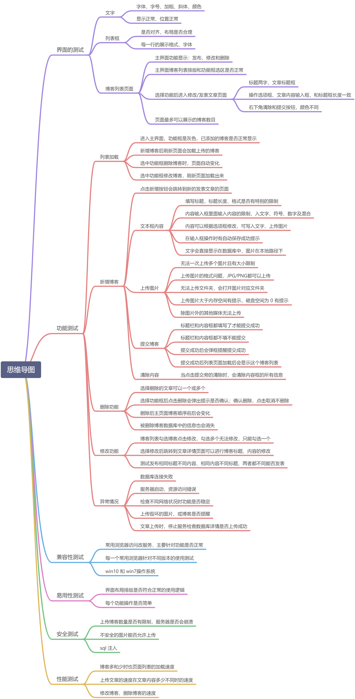

# MyBlog 项目测试

## 分析需求

整个项目主要是实现对博客文章的增删改查功能，另外在编辑博客引入了百度的文本编辑功能。

在后端开发时已经完成了单元测试和接口测试，详情可参见项目设计文档，现阶段对项目的测试要实现：

基本功能需求：

+ 查看博客列表
+ 修改博客
+ 添加博客
+ 删除博客

界面需求：布局合理，排版美观

兼容性需求：本项目主要用于管理个人博客，所以只需要兼容本机和常用浏览器即可

容错性需求：极端条件下的文本的管理

性能需求：博客数目比较多时加载速度和查找速度

安全性需求：数量上的限制等

## 制定测试方案

测试范围和测试点：

+ 界面测试需要按测试用例完成

+ 由于是网页版的，只需要测试浏览器端的所有功能模块
+ 本机操作系统是 win10 教育版，常用浏览器：火狐和 Chrome
+ 容错性测试在线编辑时断网、断电、关机、再刷新文本是否能够有效存储
+ 打开博客列表和查询博客时文章的加载速度

测试方法：手工、自动化

测试所设计的类型：

测试所涉及的类型：

+ 界面测试：手工

+ 功能测试：根据需求分析先设计测试用例，并用自动化完成测试

+ 易用性测试：手工

+ 性能测试：依照性能测试用例，可以借助性能测试工具完成测试
+ 兼容性：依照兼容性测试用例，并用自动化完成测试
+ 容错性：手工

+ 安全测试：依照安全测试用例完成

测试管理工具：可以使用禅道，这里先简单记录

# 测试执行

## 测试用例




自动化脚本：

火狐浏览器下的基本功能测试：

```
# 新增文章

from selenium import webdriver
import time
driver = webdriver.Firefox()
driver.get("http://localhost:8080/servletblog/jsp/articleList.jsp")
time.sleep(3)
# 打印当前窗口的标题
print(driver.title)
# driver.find_element_by_id("article_add_btn").click()
driver.find_element_by_link_text("发表新文章").click()
# 打印当前窗口的标题
print(driver.title)
time.sleep(3)
# 获取当前窗口的所有句柄
headles = driver.window_handles
# 切换到第二个窗口的句柄
driver.switch_to.window(headles[1])
print(driver.title)
time.sleep(3)
# 输入文章标题
driver.find_element_by_id("article_title").send_keys("测试")
 
# 进入到百度文本编辑器，使用js进行实现
# 插入文字
test_js='document.getElementById("ueditor_0").contentWindow.document.body.innerText="%s"'%("测试切换frame能否实现富文本编辑")
driver.execute_script(test_js)
time.sleep(3)

# 清除按钮
driver.find_element_by_id("btn_clear").click()
time.sleep(3)
driver.quit()
```


```
# 修改页面

from selenium import webdriver
import time
driver = webdriver.Firefox()
driver.get("http://localhost:8080/servletblog/jsp/articleList.jsp")

time.sleep(6)
# 打印当前窗口的标题
print(driver.title)
# 选择按钮
inputs = driver.find_elements_by_tag_name("input")
inputs[0].click()
time.sleep(3)
driver.find_element_by_link_text("修改").click()
time.sleep(3)
print(driver.title)
time.sleep(3)
# 获取当前窗口的所有句柄
headles = driver.window_handles
# 切换到第二个窗口的句柄
driver.switch_to.window(headles[1])
print(driver.title)
time.sleep(3)
# 清除输入框里面的内容
driver.find_element_by_id("article_title").clear()
# 重新输入内容
driver.find_element_by_id("article_title").send_keys("python测试")
# 有文本编辑器，使用js进行实现
# # 插入文字
test_js='document.getElementById("ueditor_0").contentWindow.document.body.innerText="%s"'%("测试切换frame能否实现富文本编辑")
# driver.execute_script(test_js)
# time.sleep(2)
# 提交
driver.find_element_by_id("btn_submit").click()
 
# # 清除
# driver.find_element_by_id("btn_clear").click()
time.sleep(3)
driver.quit()
```


```
# 删除文章

from selenium import webdriver
import time
driver = webdriver.Firefox()
driver.get("http://localhost:8080/servletblog/jsp/articleList.jsp")
driver.set_window_size(800,800)
inputs = driver.find_elements_by_tag_name("input")
 
time.sleep(3)
inputs[0].click()
time.sleep(2)
driver.find_element_by_id("article_delete_btn").click()
time.sleep(2)
 
# 确认删除
driver.find_element_by_id("article_delete_submit").click()

time.sleep(3)
driver.quit()

```

+ 界面界面友好简单，按钮正常跳转，文字没有乱码现象，页面可以显示文章列表
+ 基本的功能都是正常的，图片也可以正常上传，上传的图片保存在本地，能否实现图床服务器保存图片防止本地图片丢失
+ win10 下在 Chrome 浏览器和 Edge 浏览器下都是可以正常使用的，在这三个浏览器下不存在兼容性问题
+ 在文章是选择性的显示一部分，数量增多会导致进入页面加载慢。能否实现分页分类展示

## 输出测试报告

## 缺陷记录

一次测试暂时没有发现功能上的 bug，还需要根据自己积累的常见缺陷再完善用例。

## 测试结论

对基本功能做了自动化脚本测试，后序如果修改表结构增加用户的管理或者实现图片服务器

