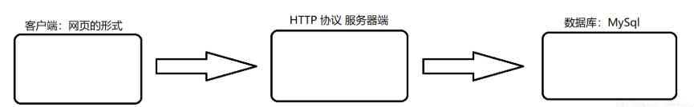
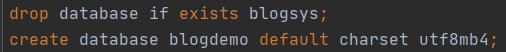
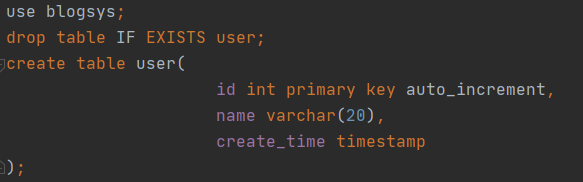
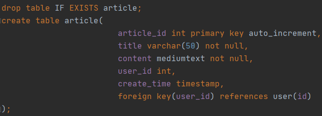
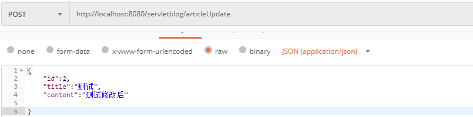
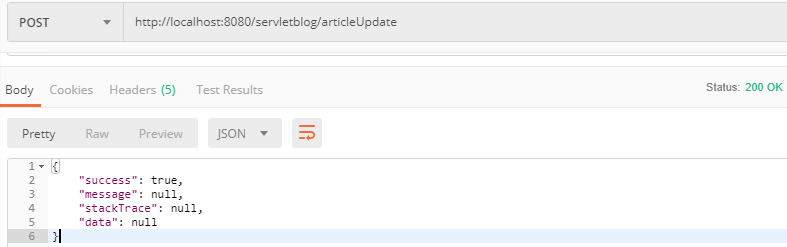
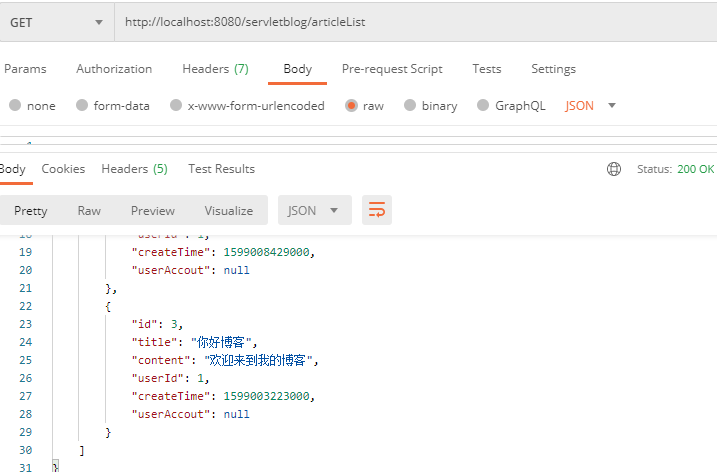

# 个人博客管理系统

### 项目背景

对个人博客、笔记的管理

### 开发环境

+ 编程语言：Java
+ 开发平台：Win10
+ 开发工具：IDEA编译器、Tomcat 服务器、MySQL数据库

### 技术栈

+ 数据库设计：使用 MySQL 数据库，JDBC 操作 DataSource，双重校验锁解决数据一致性问题
+ 前端：基于 Ajax、JSON 的数据请求和解析
+ 后端：使用 Servlet 处理 HTTP 请求

### 项目描述

基于 MVC 设计模式实现的网页版的简单博客系统，只支持单个用户对文章的 CURD



网页端显示页面：

+ 博客列表
+ 博客编辑详情页

当用户在博客列表页面执行某个操作时，比如新增博客，此时就会由客户端给服务器发送 HTTP 请求，请求包含了用户行为，服务器根据行为完成对数据库响应操作

### 详细设计

+ 分析需求

+ 数据库设计，确定表结构
+ 实现数据库操作

+ 设计前后端交互接口

+ 实现客户端、服务器端操作逻辑

#### 分析需求

支持单个用户登录操作

实现针对文章的 CURD

#### 数据库设计

这里使用 MySQL 关系型数据库

###### 创建数据库



###### 设计用户表

+ id						primary key

+ name

+ create_time

 

###### 设计文章表

+ article_id			 primary key
+ title                      not null
+ content               not null
+ user_id                foreign key
+ create_time




#### 前后端 API 设计

基于 Ajax、JSON 的数据请求和解析

使用 Servlet 处理 HTTP 请求，实现博客的 CURD


新增博客

```
POST /servletblog

{
	“title”：“xxxx”,
	“content”：“xxxx”,
	“create_time”：“xx”
}

HTTP/1.1 200 OK

{
	"success":ture
	"message":null
	"stackTrace":null
	"data":null
}
```

获取博客列表

```
查看所有博客(标题列表)

使用 GET 方法查看

GET /servletblog   		// 获取所有的

HTTP/1.1 200 OK
{
    "success": true,
    "message": null,
    "stackTrace": null,
    "data": [
        {
            "id": x,
            "title": "xx",
            "content": "xxx",
            "userId": x,
            "createTime": xxx,
            "userAccout": x
        },
      ]
   
```

修改博客

```
POST /servletblog

{
	"id":xx
	"title"：xxxx
	"content"：xxxx
}

HTTP/1.1 200 OK
{
	"success": true,
    "message": null,
    "stackTrace": null,
    "data": null
}
```

删除博客

```
DELETE /servletblog

HTTP/1.1 200 OK
{
	ok：true
}
```


### 编码阶段

#### 数据库操作

###### 创建数据库对应实体类

###### 创建 DBUtil 类管理数据库连接

+ 使用 DataSource 作为数据库连接的创建方式
+ 设计释放 JDBC 资源的方法

###### 实现数据库相关操作，即封装文章的 CURD 操作

###### 完成单元测试，即文章 CURD 操作的测试

```
package Irena.util;

import Irena.dao.ArticleDAO;
import Irena.model.Article;
import org.junit.Test;

import java.text.ParseException;
import java.text.SimpleDateFormat;
import java.util.ArrayList;
import java.util.Date;
import java.util.List;

public class ArticleDAOTest {

    @Test
    public void list() {
		  List<Article> articleArrayList = new ArrayList<>();
        ArticleDAO articleDAO = new ArticleDAO();
        articleArrayList = articleDAO.queryByUserId(1);
        System.out.println("数据库中的文章数："+articleArrayList.size());
        for(Article article:articleArrayList){
            System.out.println("文章的名称："+article.getTitle());
        }

    }

    @Test
    public void insert() {
        //构建对象article
        Article article = new Article();
        article.setTitle("测试标题");
        article.setContent("测试内容");
        article.setUserId(1);
        //将Stringlei类型转换为Date类型
        java.text.SimpleDateFormat formatter = new SimpleDateFormat( "yyyy-MM-dd HH:mm:ss");
        String s = "2020-06-01 18:13:40";
        Date date = null;
        try {
            date = formatter.parse(s);
        } catch (ParseException e) {
            e.printStackTrace();
        }
        article.setCreateTime(date);
        //用insert方法
        ArticleDAO articleDAO = new ArticleDAO();
        int flag = articleDAO.insert(article);
        System.out.println("flag:"+flag);

    }

    @Test
    public void query() {
        public void query() {
        List<Article> articleArrayList = new ArrayList<>();
        ArticleDAO articleDAO = new ArticleDAO();
        articleArrayList = articleDAO.query(1);
        System.out.println("数据库中的文章数："+articleArrayList.size());
        for(Article article:articleArrayList){
            System.out.println("文章的名称："+article.getTitle());
        }

    }
    }

    @Test
    public void update() {
        Article article = new Article();
        article.setId(3);
        article.setTitle("你好博客");
        article.setContent("欢迎来到我的博客");
        ArticleDAO articleDAO = new ArticleDAO();
        articleDAO.update(article);
        System.out.println("更改后文章的标题："+article.getTitle());
        System.out.println("更改好文章的内容："+article.getContent());

    }

    @Test
    public void delete() {
        int [] ids = {34};
        Article article = new Article();
        ArticleDAO articleDAO = new ArticleDAO();
        int flag = articleDAO.delete(ids);
        System.out.println("flag:"+flag);

    }
}
```


##### 服务器端

使用 Jackson第三方类库完成 Java 对象和 JSON 数据之间的映射。使用 Postman 工具模拟客户端请求测试各个接口是否正常可用

根据 id 修改博客

请求



响应




获取现有博客信息




实现百度的文本编辑器的功能：

+ 配置 tomcat 的项目部署名
+ pom.xml 中的 finalName 作为手动部署的项目名字
+ 在 config.js 中，修改 server Url 的部分，格式为/项目部署名/上传图片的 servlet 路径
+ 实现上传图片的 servlet
+ 复制一个 java 文件，基于这个 java 类编写 servlet 中的功能

##### 客户端

实现一组网页，通过网页和服务器交互

通过 ajax 发送数据请求，约定好统一返回的 json 数据格式

主要实现的页面：

+ 文章列表
+ 文章修改页面

#### 小结

存在问题：

+ 博客列表显示是直接加载所有博客和标题，只是选择性显示如果博客数量增多会导致进入页面加载慢
+ 实现一个图床服务器存放图片
+ 支持多用户（对数据库的表结果重新设计）cookie session
+ 实现分页分类展示
+ 搜素博客功能（数据库：Like 复杂的话：倒排索引？）


